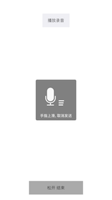
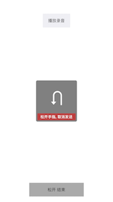
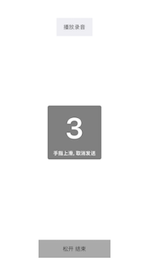

# SRAudioRecorder

An audio recorder like WeChat's interaction.

  

## APIs

````objc
typedef NS_ENUM(NSInteger, SRAudioRecorderState) {
    SRAudioRecorderStateNormal,
    SRAudioRecorderStateRecording,
    SRAudioRecorderStateCountdown,
    SRAudioRecorderStateDurationTooShort,
    SRAudioRecorderStateReleaseToCancel,
    SRAudioRecorderStateCancel
};

@protocol SRAudioRecorderManagerDelegate <NSObject>

@optional
- (void)audioRecorderManagerAVAuthorizationStatusDenied;
- (void)audioRecorderManagerDidFinishRecordingSuccess:(NSString *)audioFilePath;
- (void)audioRecorderManagerDidFinishRecordingFailed;

@end

+ (instancetype)sharedManager;

- (void)startRecording;
- (void)stopRecording;
````

## Usage

Only need to use SRAudioRecordButton replace the button which triggers recording action, more detail please see the demo.

## Custom

````objc
/**
 The maximum duration of recoding audio, default is 60s.
 */
@property (nonatomic, assign) NSTimeInterval maxDuration;

/**
 The minimum duration of recoding audio, default is 3s.
 */
@property (nonatomic, assign) NSTimeInterval minDuration;

/**
 The point to show countdown, default is 10s.
 */
@property (nonatomic, assign) NSTimeInterval showCountdownPoint;
````